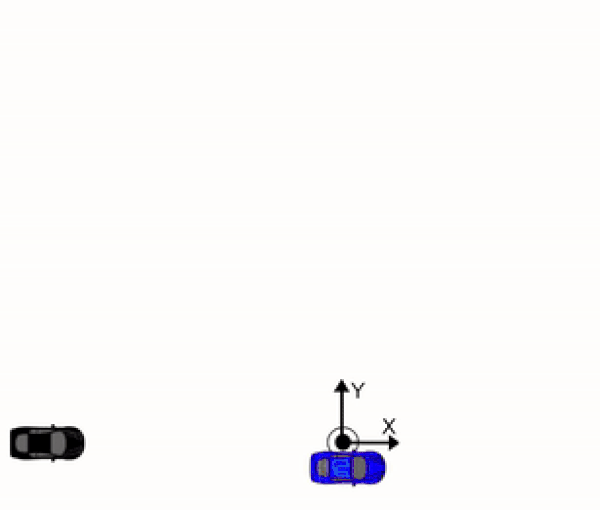
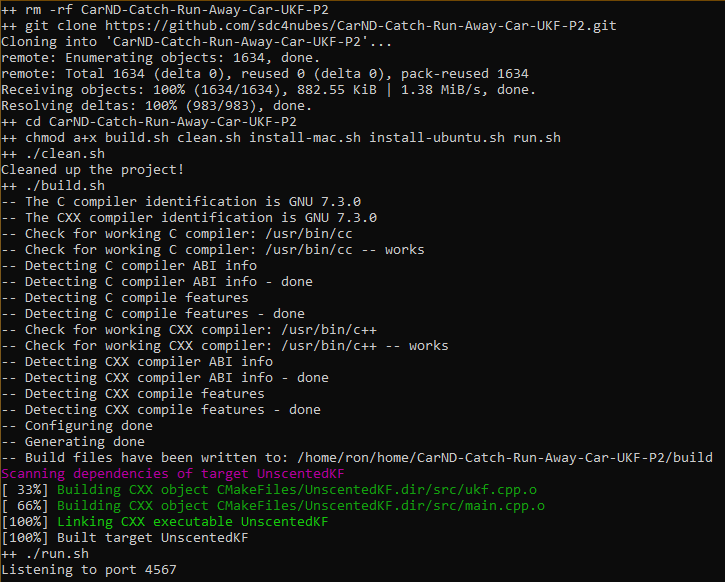
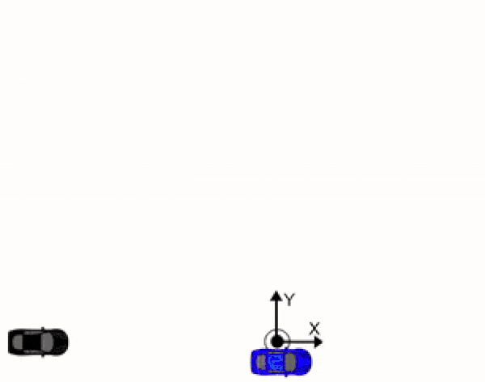

Project 2B, Term 2: Run Away Robot with Unscented Kalman Filter Bonus Challenge
=======================

Final Result
------------

Compiling
---------

#### Code must compile without errors using cmake and make.

The code compiles without errors:

Follows the Correct Algorithm
-------------------

The ukf.cpp and ukf.h programs used here are exactly the same as those used in Project 2, Term 2.

**Your Kalman Filter algorithm handles the first measurements appropriately.**

The algorithm uses the first measurements to initialize the state vector. The state vector is initialized at the beginning of the UKD::ProcessMeasurement function.

**Your Kalman Filter algorithm first predicts then updates.**

Upon receiving a measurement after the first, the algorithm predicts object
position to the current timestamp and then updates the prediction using the new
measurement.

**Your Kalman Filter can handle radar and lidar measurements.**

The algorithm calls the same function for both radar and lidar measurements; however, it sets up the appropriate matrices given the type of measurement.

Code Efficiency
---------------

**Your algorithm should avoid unnecessary calculations.**

I avoided the following:

-   Running the exact same calculation repeatedly when I could run it once,
    store the value and then reuse the value later,

-   Loops that run too many times,

-   Creating unnecessarily complex data structures when simpler structures work
    equivalently,

-   Unnecessary control flow checks.

Simulation
--------------
#### Does your UKF enhanced vehicle  catch the escaped car driving in a circular path?

The UKF enhanced vehicle not only catches the escaped vehicle most of the time within 5 seconds (see top of page), but when it misses, it has a feature that allows it to keep trying. 

